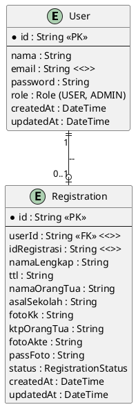
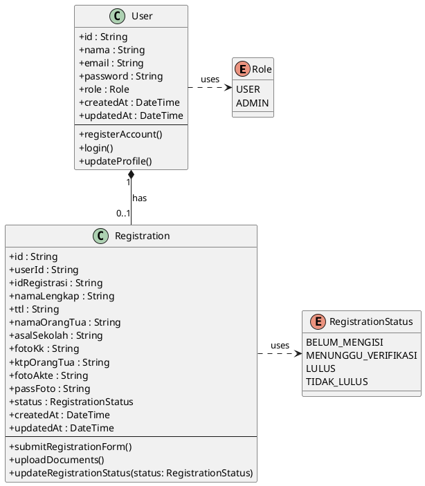
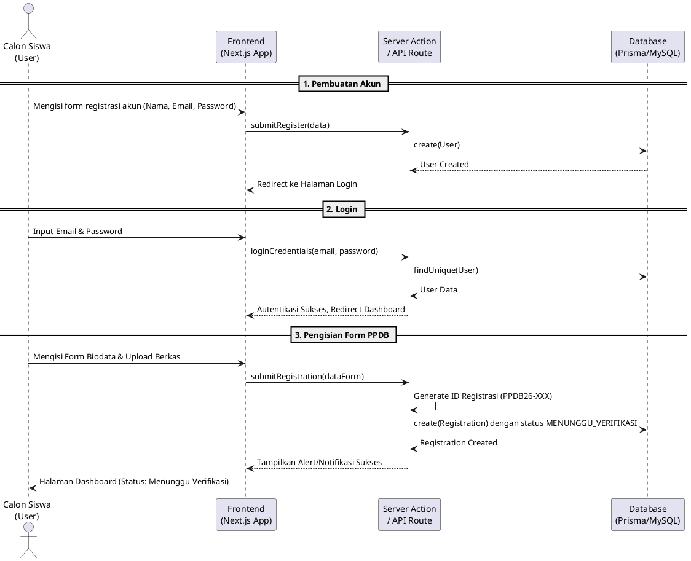
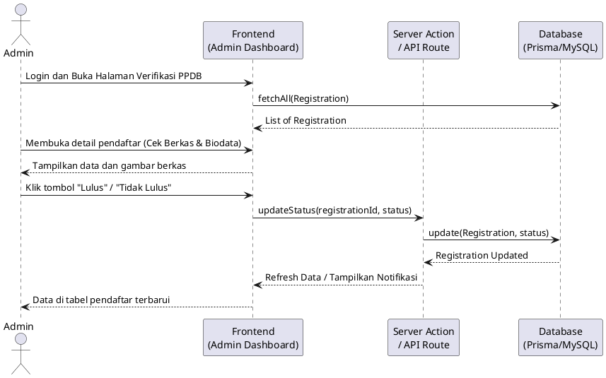
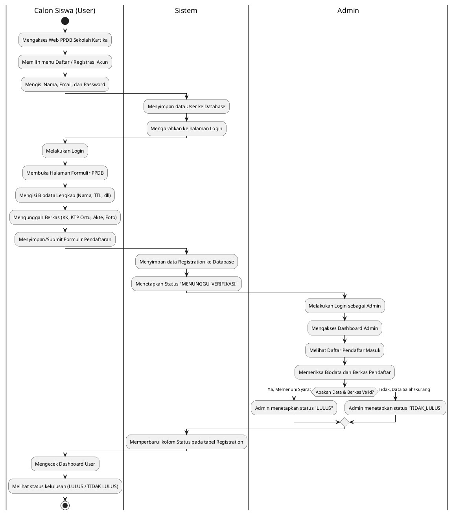

# Dokumentasi Sistem Informasi PPDB (Penerimaan Peserta Didik Baru)

Dokumentasi ini merupakan penjabaran lengkap terkait arsitektur dan alur Sistem Informasi PPDB yang dibangun menggunakan Next.js dan Prisma ORM. Proyek ini memfasilitasi proses pendaftaran siswa baru, mulai dari pembuatan akun, pengisian biodata dan unggah berkas, hingga proses verifikasi oleh Admin.

---

## 1. Entity Relationship Diagram (ERD)

ERD di bawah ini merepresentasikan struktur database sistem berdasarkan Prisma schema. Terdapat relasi *One-to-One* (atau *One-to-Zero*) antara tabel `User` dan `Registration`.

---

## 2. Class Diagram

Class Diagram ini memperlihatkan struktur entitas aplikasi (Model) dan *Enumeration* yang mendefinisikan tipe role dan status, beserta method/operasi yang umumnya melekat secara logis pada *domain model* tersebut.

---

## 3. Sequence Diagram

Sequence diagram di bawah ini menjelaskan urutan pengiriman pesan antar objek atau komponen dalam skenario-skenario utama.

### A. Sequence Diagram: Pendaftaran & Pengajuan PPDB (Calon Siswa)

### B. Sequence Diagram: Verifikasi Pendaftaran (Admin)

---

## 4. Activity Diagram

Activity diagram di bawah ini menjelaskan alur kerja (workflow) dari sudut pandang proses bisnis PPDB, melingkupi interaksi dari sisi calon siswa hingga pihak Admin yang memberikan verifikasi.

